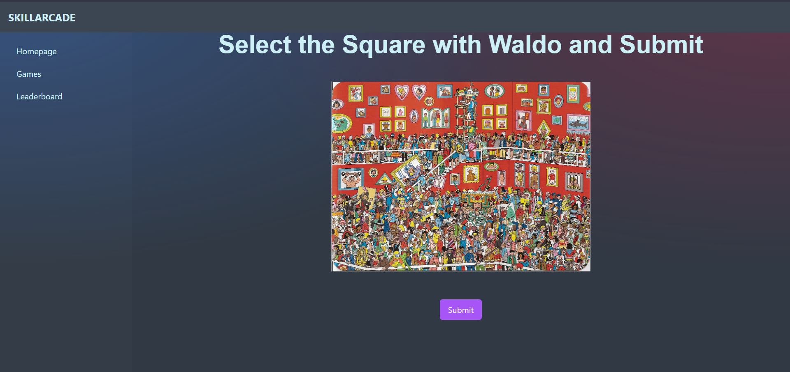

<h1 align="center"> Skill Arcade</h1> <br>

<h2 align="center">
Test and Train you Soft Skills!

[Visit Website](https://skill-arcade.vercel.app)

</h2>
<hr>

## Table of Contents

- [Introduction](#introduction)
- [Implemented Features](#implemented-features)
- [Additional Features](#additional-features)
- [Soft Skills](#soft-skills)
- [Puzzles and Solutions](#puzzles-and-solutions)
  - [Technologies](#technologies)

# Introduction

Skill Arcade is a website to test users various soft skills. It is an engaging game designed to test users soft skills. Skill Arcade gives presents users with multiple challenging games to test their soft skills while keeping them intrested. With its tests designed to test multiple soft skills it is one of the best ways to test and hone your skills.

<hr>

# Implemented Features

- **Register and Login**: On visiting the website user is prompted to create an account. Anyone with an email and password can create an account on our website and can enjoy the games which test their soft skills. The user details are stored in database to keep track of user progress and metrics.
- **Contains 5 Puzzles**: Game contains 5 level each level have puzzle user have to solve. Each puzzle has one solution and can have dead ends. The time and the number of attempts taken by the user are continuously monitored and stored in database.
- **User Progress**: The time user takes to solve each puzzle is stored in the database for determining the skills. We also store the number of attempts user takes in finding the solution and assign the user score for the game based on both the factors.
- **User Profile**: It contains information about user progress.
- **Admin Dashboard** : The admin of the website can track the performance of all the users who played any number of levels from the admin dashboard accessible by logging in into admin account.
- **Browser Compatibility**: On Refressing browser or starting a new session the game will restart and the user will be tracked to get good measures of skills.

# Additional Features

- **User Analytics**: Time taken to solve each puzzle and attempts taken to solve it is stored and tracked with other user's data. Provides analysis on how you performed compared to best player and average players.
- **Data Analytics**: The user is also presented with a radar chart displaying his skills in a graphical and interactive way.
- **Leaderboard**: The top 10 players who completed the game and performed better than other in terms of scores assigned on the basis of time and attempts.

<hr>

# Soft Skills

- **Pattern Recognition**
- **Memory**
- **Problem Solving**
- **Eye for Details**
- **Data Interpretation**
- **Logical Reasoning**

<hr>

# Puzzles and Solutions

    Level 1: Sequence Memory
     Puzzle : The user has to remember a sequence of glowing blocks displayed on the screen and then repeat the same blocks in the same order.


    Level 2: 15 puzzle problem
     Puzzle : In this the user is provided with 4x4 grid with numbers in random order. The goal is to arrange all the numbers in order.


    Level 3: Finding Waldo.
     Puzzle: In this puzzle the user has to find the image of waldo hidden in the picture.

    Answer : The first tile in 3rd row.



    Level 4: Einsteing Problem
     Puzzle : In this problem the user is provided with 15 clues and he has to deduce the answers.

    Answer :
    ```

| House 1   | House 2 | House 3   | House 4 | House 5     |
| --------- | ------- | --------- | ------- | ----------- |
| Yellow    | Blue    | Red       | Green   | White       |
| Norwegian | Dane    | Brit      | German  | Swede       |
| Water     | Tea     | Milk      | Coffee  | Beer        |
| Dunhill   | Blend   | Pall Mall | Prince  | Blue Master |
| Cat       | Horse   | Birds     | Fish    | Dog         |
| ```       |         |           |         |             |


    Level 5: Murder Mystry Puzzle
     Puzzle : In this puzzle the user has to deduce the spot where the victim was when he was murdered.

    Answer : Tile in 6th row 5th column


<hr>

## Technologies

Sveltekit

MongoDB

Vercel
